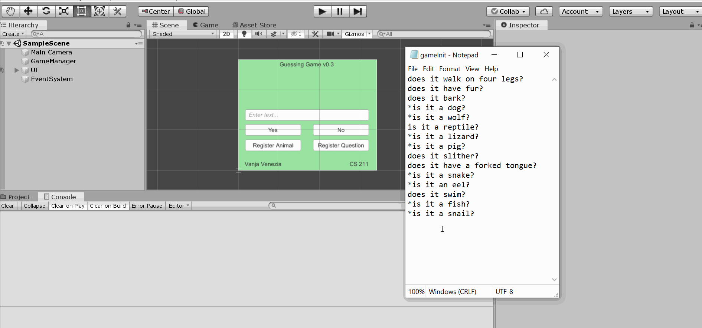

# Milestone 4 Dev Diary - Vanja Venezia #

## Github Commit Comments ##

Mar 19:

added some basic building blocks. still need to figure out how to handle read/write from file in C#

--

Tree.cs now initializes a string array from gameInit.txt

--

took some ideas from TreeBuilder.cs and built a BuildList() function that returns a list of nodes with questions loaded from a text file.

next I am going to write a BuildTree() function that utilizes a preorder traversal to build the actual tree itself.

--

Mar 20:

starting to construct a preorder traversal recursive function to build out the tree. still not functional but getting there

--

Mar 21:

fleshed out the BuildTree() method I've been writing. As far as I understand, it should function properly and build out the tree. I can't test it though as the solution provided on the cs211 github does not run or compile for me, no matter what settings I use, and I cannot get VS to run my files to give it a shot. Probably going to have to build out the C# code base and test entirely via Unity.

That being said, I'm feeling solid about my file reading and tree building system at the moment, it is not the most efficient but the code works in a relatively elegant fashion (assuming it actually works).

--

Reformatted my tree setup and removed Unity conflicts. The Unity project now runs! I have yet to check to make sure the tree is working properly, but no compile errors at the moment. Going to implement some Unity buttons and textboxes to test.

Note: Tree is now called QuestionTree as Unity has it's own definition for Tree.

--

Mar 23:

Added game title and fixed some internal pathing. Attempting to pull the _root node question out and populate my question field in Unity with it. For some reason I am not able to do so. Not sure if my tree is not building correctly or if the BuildTree() method is getting stuck in a loop (which it shouldn't be). Could be any number of other things. I feel like the root cause of the problem is the disharmony between non-Monobehaviour "scripts" in Unity and Unity itself.

--

Mar 27:

Game now loads properly. Have yet to test construction of tree, but I figured out why my Question Text could not update from the root node of my decision tree. I was using void Start() when I should have used Awake() for the Setup of my tree in GameManager.

--

I've added buttons and helper functions that iterate through the tree with yes and no button clicks. So far, everything is working except my tree seems to not have built correctly and I still need to prompt for a new question and animal. Thinking about restarting my BuildTree() method from the ground up as I've realized a simpler implementation (I think).

--

fixed error in BuildTree() during check-in, changed gameInit.txt to reflect a real tree as it was not a proper tree beforehand.

--

realized I had mirrored yes and no paths on the no branch from my root in the design diagram and in the gameInit, so the left half of the tree was functioning but the right half was inverted. Should be fixed now.

All thta is left is prompting for a new animal and question as well as writing those to gameInit.txt

--

updated version to 0.2, text box and relevant buttons have been added, animal and question adding feature still unimplemented

--

simplifying and reoptimizing strategy for taking input and writing file. cleaned up project a bit, nad commented a reminder.

--

added better commenting for planning

--

Mar 28:

Register Animal and Register Question buttons should now store text box contents in respective strings in GameManager. Added dummy method that will eventually create and add nodes to tree. AddNewAnimal() is next priority, followed by WriteToFile();

--

game now properly prompts for new animal and question and then properly adds those elements into the tree. the only thing left to do now is to build a recursive ULR traversal function to write the updated tree to gameInit.txt

--

Mar 29:

I've written a set of functions to build a List of questions from a ULR traversal of the tree, convert them to an array, and then write them to a test text file (so my initialization file stays as is until I'm certain the functions are working). Everything appears to be working correctly, except the new animal and relevant question are not reproduced. The test file currently seems to always output a copy of the original initialization file. This is strange because I have my program outputting the contents of the leaf that was replaced and it's new children (yes being the newly added animal and no being the previous no question that was replaced) to the Unity console and it works correctly. My only thought is that for some reason, I am not editing the tree but rather a reference to the tree? Not entirely sure, glad everything else is working as intended currently tho!

--

changed my saveLeaf variable from a Node to a string, as it only needs to store a string. I thought this might be what was causing the issue with my tree seeming to not actually store the new animal and question; it wasnot. Leaving this change in though as I imagine it improves the space and time efficiency slightly to create and write a string variable over a Node object.

--

After having Adam look over my code and point out an error in my tree insertion logic, I decided to take a completely different and much more elegant approach to updating gameInit.txt. Instead of editing the tree, converting it back into an array, and then writing that array to a file, I build a duplicate of the questionNodes array as a list that only stores the question strings in BuildList(). I can then simply insert the new question and animal into the location in the list that matches the last saved question in saveLeaf. This means I am able to bypass three methods entirely, albeit with a slight hit to overall game performance potentially (not that it is noticeable at all). As of right now, everything functions exactly as intended.

## Overall Reflection ##

When this milestone was first assigned, I wasn't too concerned as it seemed pretty straightforward and I wanted to come up with a game idea that I found more exciting. As spring break approached, other classwork took precedence with much more urgent due dates and I further put off starting this project. During spring break I got one of the worst cases of Sinusitis I've had in my life and it made it pretty hard to think properly and get any significant work done. I decided to just go with the default assignment and start it in Unity so I wouldn't have to worry about connecting it or reformatting it after having a finished version in C#.

I quickly realized that this was a much more daunting and difficult assignment than I had previously thought, mostly due to my limited C# knownledge (mostly enougth to script in Unity at this point). I couldn't decide on a method for extracting the contents of the initialization text file because everything I read online seemed massively overcomplicated and I read that there was no implementation of iStringStream in C#. This led me to Adam's starter code where I found the method that reads the contents of a file into an array which I copied over. I also noted that his method of building that array into Nodes was exactly what I had in mind so I mostly copied that over, exluding a chunk I didn't fully understand and found unnecessary for my needs.

I struggled with the tree creation and initialization as I didn't quite understand which traversal I should use but ended up writing a ULR traversal which ended up working out down the line. I couldn't get my tree to build in Unity so I had no way of testing anything up until this point for a decent amount of time after. I just trusted in my code and (probably foolishly) kept writing more code and trying to build out as much of the game as I could without testing it. Eventually I found out that I was using the wrong MonoBehaviour method to link my tree to my text box and I was finally able to test. I ran into tree issues and became quickly lost again because I couldn't see what was wrong with my tree building methods, and seeing as the rest of the code I wrote working mostly as intended, I had no where to focus my debugging.

The lab check-in with Adam shined light on my issues, which ended up being a logical error in my recursive tree building method and my initialization file being not a valid tree. After this help, I was able to continue on without any problems until it came to writing my file. Originally, I had a method that added the new animal and queston into the tree (in the wrong place, as Adam later pointed out to me), then another method was called that was meant to call a method that started a recursive loop to build an array from the updated tree and then write that array back to the initialization file (or a secondary test file until I had it working). It seemed like my method was properly adding the new nodes to the tree but my new initialization file was identical to the original.
I hit anothe wall here so I sent my code to Adam who was kind enough to pour over it and point out that my nodes were not being inserted properly.

After this advice I wasn't sure how to proceed. I couldn't think of a way to pull a reference to the parent of the node I ended on that was higher up the tree than the one I had already pulled out as saveLeaf. Since I couldn't figure out how to fix the tree immediately, and I didn't want to write yet another recursive function to search for a specific node in the tree either, I came up with the idea of just pulling a reference to the original array I built the tree from and operating on the array itself, which definitely simplifies writing it to a file. I realized I had systematically deleted my tree during tree creation to simplify logic and instead tried pulling a copy of it out to preserve the full list. I decided it'd be easier to extract it straight from the initialization file again, so I did that.

My first idea to operate directly on the array involved copying it into a separate array that was two strings longer so I could just overwrite my two new questions after finding their index and then iterate with i and i+2 to copy the rest of the contents from the original array. After frantic C# array documentation reading and reworking of my method I found that I don't like C# arrays. This led me to my current solution that I am quite proud of. I added a new empty List of strings to the class that has each question added to it while the BuildList() method is iterating through the question array and constructing the nodes. I then had a clean List of strings formatted exactly like my initalization file array. Because I am working with an ULR traversal and the new questions added will always be linked with a "yes", I was able to simply insert the new question and animal guess leaf node into the array at the index of saveLeaf (after finding that index with a quick search). I could then use C#'s wonderful ToArray method to create an array of the updated tree and write it directly to the intialization file. I try to be humble but I really am proud of the elegance of this solution, I was able to cut out three whole methods and really solidified my understanding of trees and their array representations as well.

This project has taught me a lot and I finally feel confident in my applicaton of trees via code; previously, I was confident in my theoretical and logical understanding of trees but not at all confident in my ability to apply them. I am very grategul to Adam for helping me past the two major roadblocks I hit and for due date extensions. I went from dismissive of the project, to petrified, to feeling very confident in my coding abilities (at least to this class's level). Additionallu, my newfound love of C# has been bolstered. I am stoked on this project now and honestly excited for the next milestone. Thanks for designing thoughtful assignments Adam!

## Gif ## 

